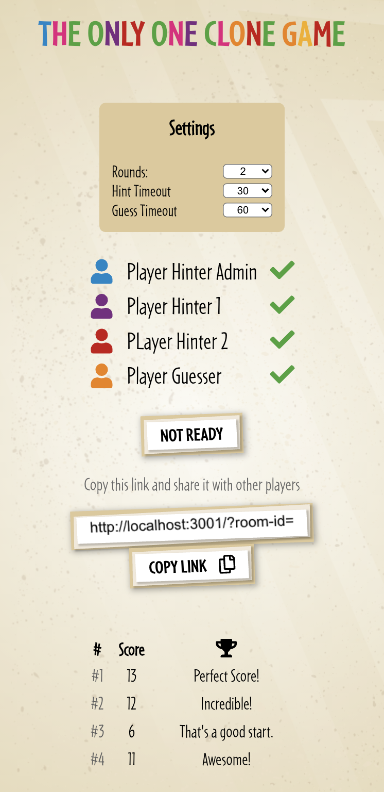
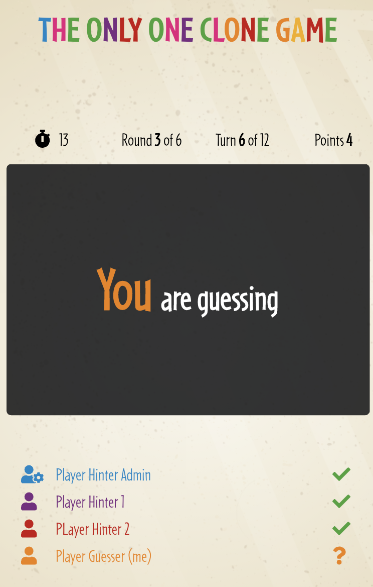
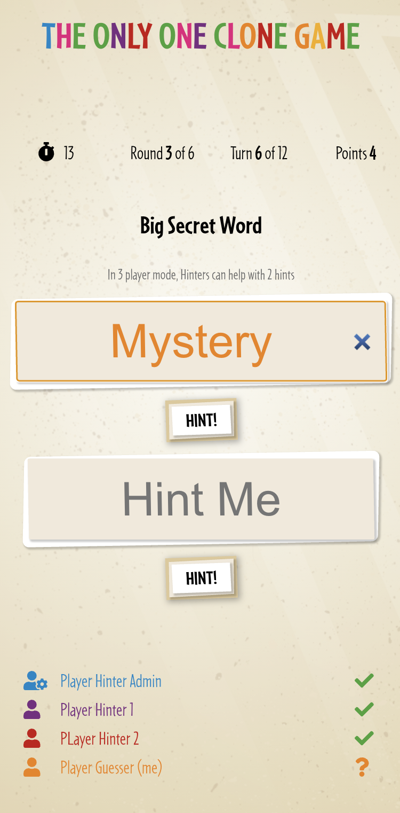
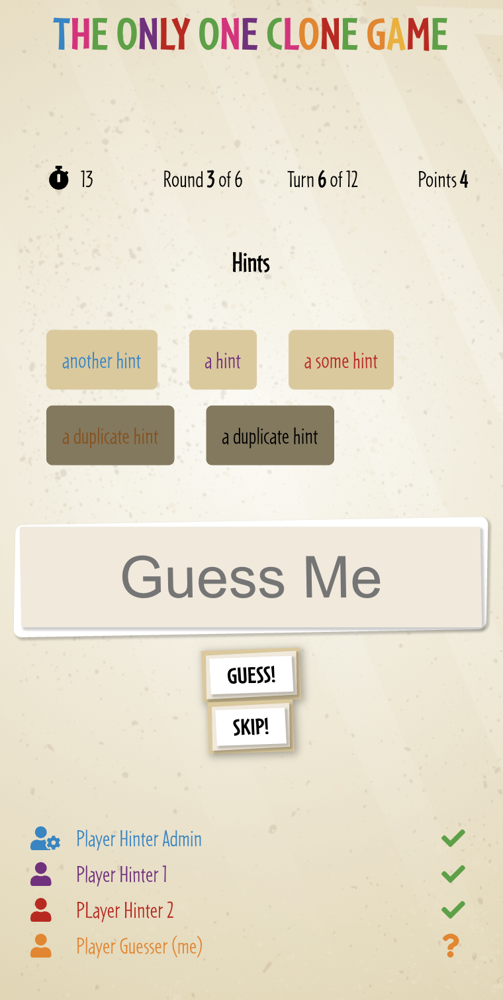
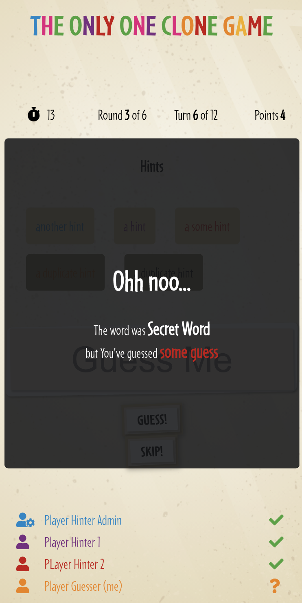

# The Only One Clone Game

This project is a multiplayer game based on The Only One board game.

## `Technologies used`

```text
NodeJs
React
Typescript
Websockets
Yarn
```

## `Development Setup`

`API`

```shell
cd ./the-one-clone-api
yarn install
yarn start
```

`API TEST` _mocha with chai_

```shell
cd ./the-one-clone-api
yarn test
```

`UI`

```shell
cd ./the-one-clone-ui
yarn install
yarn start
```

`UI TEST` _Jest_

```shell
cd ./the-one-clone-ui
yarn test
```
`HTTPS`

Generate localhost crt and key for local https development

The UI has a mock-mode where all individual components can be toggled on/off

The api start on the PORT `3000` the UI configured to run on PORT `3001`
Locally the app is accessible through: http://localhost:3001

## `How to play`

```text
3-10 players

1. Name yourself
2. Join the lobby, say you're ready
3. Provide hints
4. Remove possible duplicates
5. Guess the secret word
6. Enjoy!

Give yourself a name and join the lobby, You'll find a link there, share it with your team, so they can join to the same room.
When all players mark themselves as ready, the game begins.

All the players are working as a team, the goal is to guess a secret word.
One player is guessing the others are helping the guesser with hints (one word hints, one help per player)
Once the players submitted their hints the admin player can/have to remove duplicates and then the guesser player can try guessing the secret word.
You play in rounds, each round has 12 turns.

Points:
When the word was correctly guessed you earn 1 point.
When you guess incorrectly you loose a turn, if it's the last turn you loose a point.
You can skip, then no points or turn lost.

Roles in the game: 
Admin: Can start a game, can remove duplicates
Guesser: The player who currently trying to guess the secret word, this role rotates by turn.
Hinters: Players who are helping the guesser with hints

3 Player mode:
When played with only 3 players, the 2 hinters can submit 2 hints each.

Game Over:
It's game over when there are no more rounds to play, or all but one player left the game.

One can leave and rejoin the game any time.

```

<p>
    
    
    
    
    
</p>